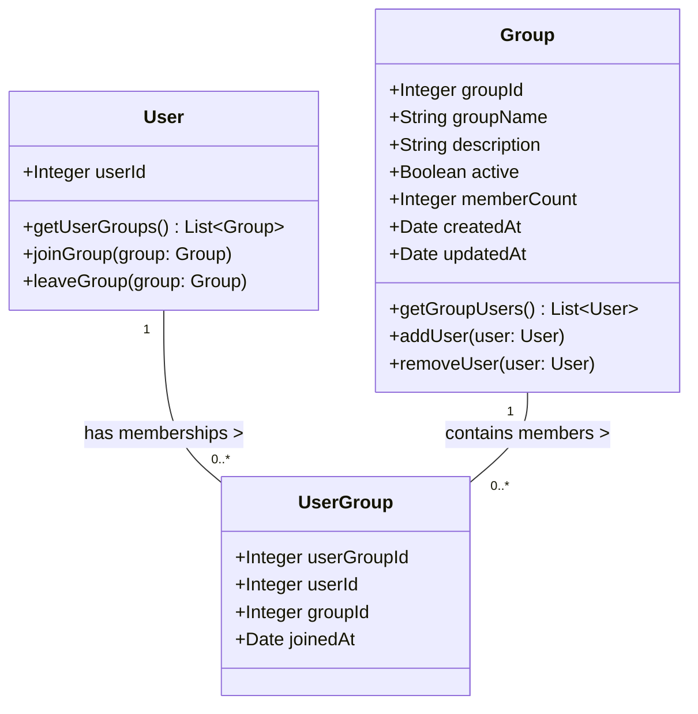

# User & Group Services - Engenharia de Software II
**Autores**: Gabriela Dellamora Paim, Eduarda Floripo, Gabriel Botega, Giancarlo Brandalise e Maria Eduarda Ourique

**Swagger**: colar conteúdo do arquivo [openapi](./openapi.yaml) no [editor de swagger](https://editor.swagger.io)

---

**Dependências de Leitura**:
- Report Service
- Survey Application
**Dependência Direta**:
- Assessment Service
---
## Ambiente de Desenvolvimento (Docker)
O projeto roda em Docker via `docker-compose.yml` (API + PostgreSQL) e é gerenciado
pelo script [`dev.sh`](./dev.sh). As migrações de [`db/`](./db) são aplicadas
automaticamente na primeira inicialização do banco.

```bash
./dev.sh up        # sobe api + db (API em http://localhost:8000, docs em /docs)
./dev.sh logs      # acompanha os logs da api
./dev.sh test      # roda a suíte pytest em um container
./dev.sh psql      # abre o psql no banco
./dev.sh reset     # recria o banco do zero (reaplica as migrações)
./dev.sh down      # para o stack
./dev.sh help      # lista todos os comandos
```

> As credenciais no `docker-compose.yml` são apenas para desenvolvimento.

---
## Arquitetura:
- Python
- API REST
- PostgreSQL Relacional
- **Backend-only**: não exposto à internet, consumido apenas pelos serviços listados em *Dependências*
- Transporte protegido por mTLS (service mesh)
- Identidade do chamador via header `X-Service-Id`; contexto do usuário propagado via `X-User-Id` (este serviço **não valida JWT** — a validação do token emitido pelo Autorizador é feita no edge do consumidor)

## Acesso
Cada serviço consumidor se identifica com um `X-Service-Id` fixo:

| Serviço consumidor   | `X-Service-Id`         | Permissão        |
|----------------------|------------------------|------------------|
| Assessment Service   | `assessment-service`   | CRUD completo    |
| Report Service       | `report-service`       | Somente leitura  |
| Survey Application   | `survey-application`   | Somente leitura  |

Todo request deve trazer também `X-User-Id` (inteiro) com o usuário em nome do qual a operação é feita. Valores inválidos ou ausentes → `401 Unauthorized`. Escrita de serviço somente-leitura → `403 Forbidden` (`READ_ONLY_SERVICE`).
## Responsabilidades:
- Nós armazenamos informação de acessos
- Como os outros microsserviços recebem ID do user?
	- Os outros serviços têm acesso direto ao Autorizador
- Como os outros microsserviços recebem ID do group?
	- Endpoint de listagem de grupos

### Diagrama do Banco

---
## Endpoints:
> Todos os endpoints exigem os cabeçalhos `X-Service-Id` e `X-User-Id` (ver seção *Acesso*). Contrato completo em [openapi.yaml](./openapi.yaml).

#### Grupo
- `POST /v1/group`
	- Cria um grupo e retorna o objeto criado + header `Location`
- `GET /v1/group`
	- Lista paginada de grupos (`?page=&pageSize=&active=&search=`)
- `GET /v1/group/{group-id}`
	- Retorna informações do grupo + users inseridos
- `PUT /v1/group/{group-id}`
	- Atualiza nome/descrição do grupo (suporta `If-Match` para concorrência otimista)
- `DELETE /v1/group/{group-id}`
	- Soft-delete do grupo (marca como inativo)

#### Membership
- `PUT /v1/group/{group-id}/user/{user-id}`
	- Adiciona usuário ao grupo (idempotente, retorna a associação)
- `DELETE /v1/group/{group-id}/user/{user-id}`
	- Remove usuário do grupo

#### Usuário
- `GET /v1/user/{user-id}`
	- Retorna informações do usuário + grupos que está inserido
