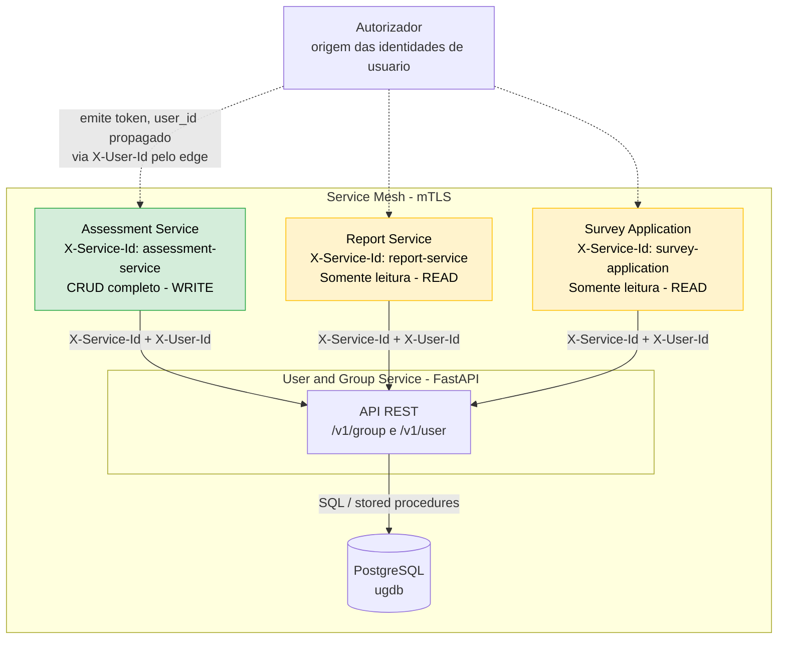
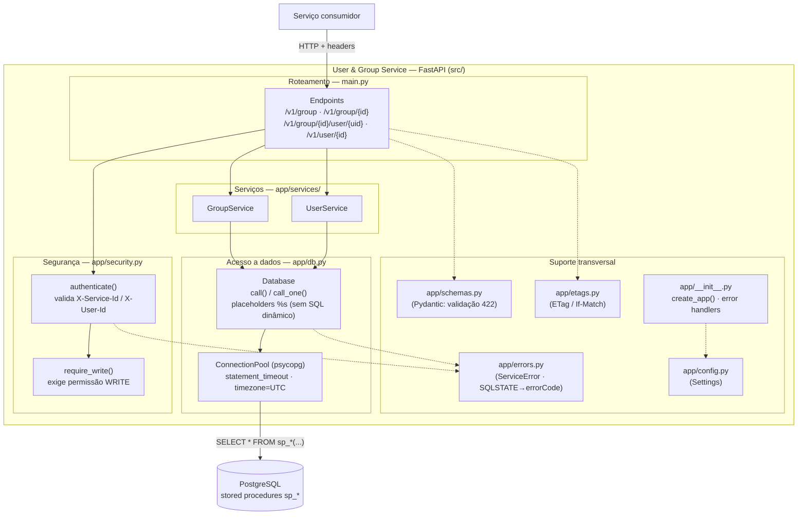
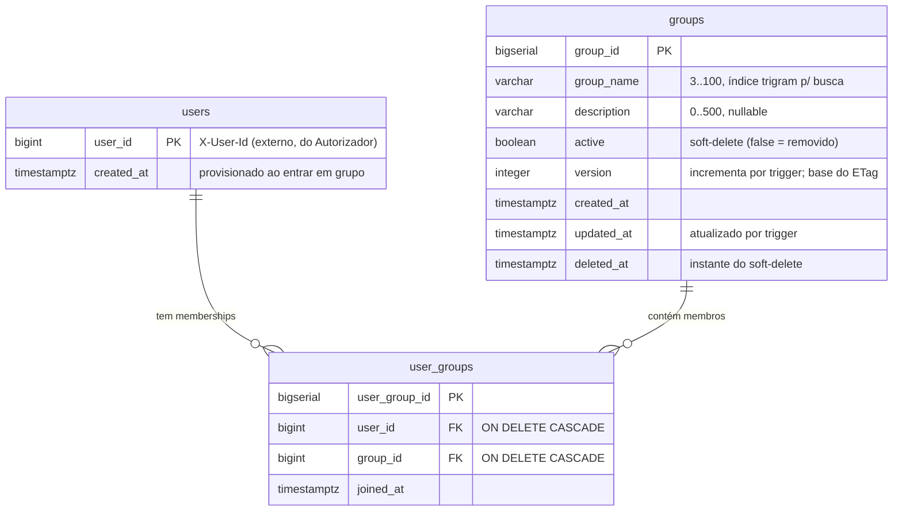
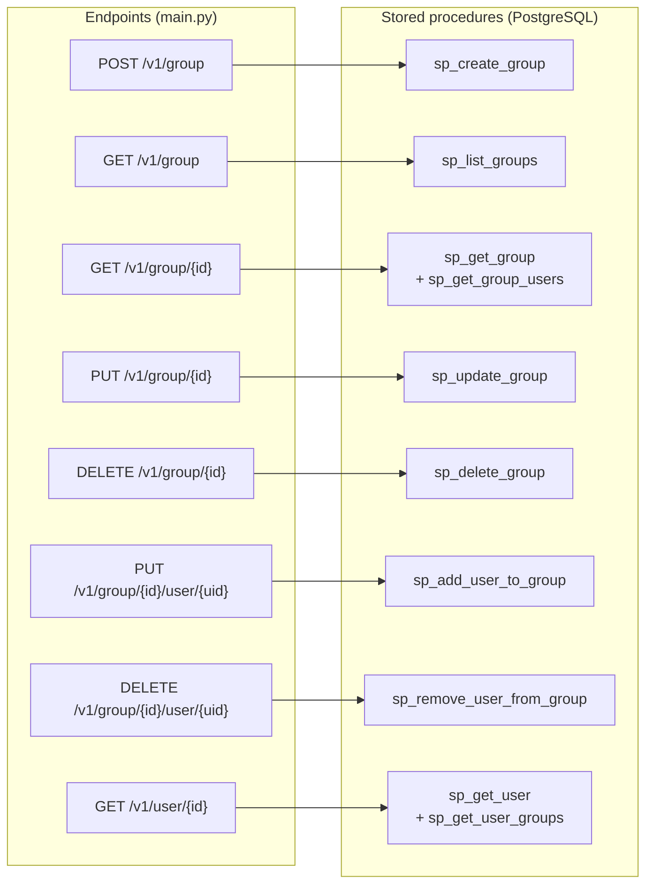
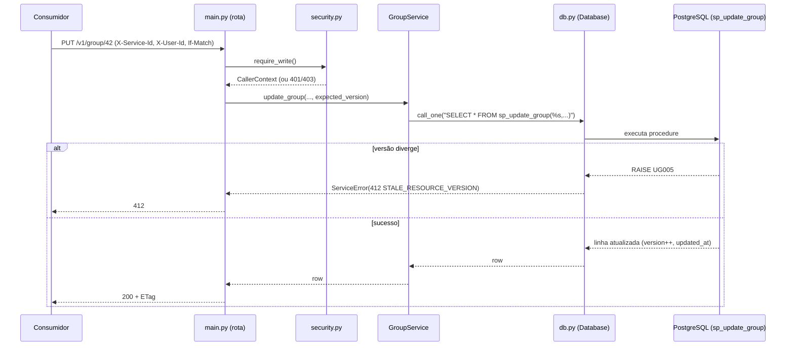
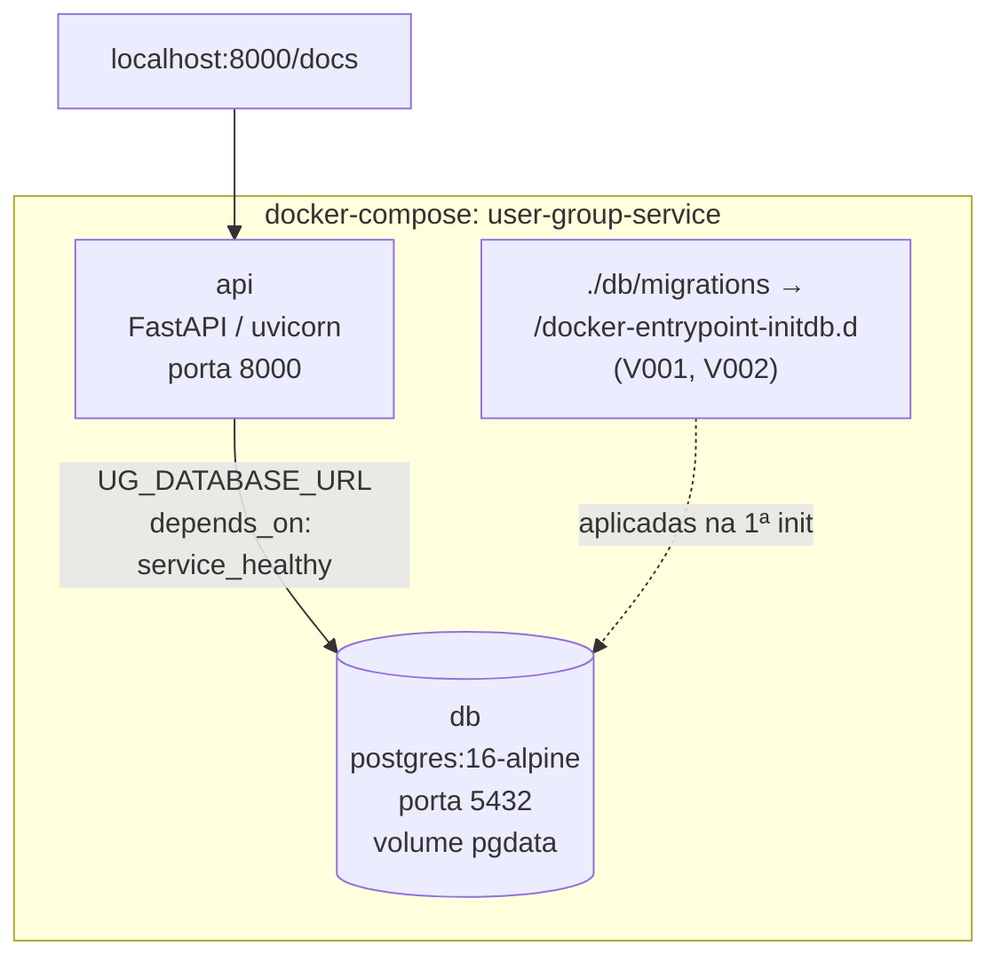

# Arquitetura — User & Group Service

Documentação de arquitetura do serviço. Os diagramas estão em [Mermaid](https://mermaid.js.org)
e renderizam diretamente no GitHub.

O serviço é **backend-only**: não é exposto à internet, é consumido apenas por
outros microsserviços sobre **mTLS** (service mesh). A identidade do chamador
chega no header `X-Service-Id` e o usuário em nome de quem a operação ocorre no
header `X-User-Id` — este serviço **não valida JWT** (isso é feito no edge do
consumidor).

---

## 1. Contexto do sistema (consumidores e confiança)

**Allowlist de serviços** (fail-closed — qualquer outro `X-Service-Id` → `401`):

| Consumidor          | `X-Service-Id`       | Permissão     |
|---------------------|----------------------|---------------|
| Assessment Service  | `assessment-service` | CRUD (WRITE)  |
| Report Service      | `report-service`     | Leitura (READ)|
| Survey Application   | `survey-application` | Leitura (READ)|

---

## 2. Arquitetura interna em camadas

Cada requisição passa por autenticação/autorização, é resolvida por **injeção de
dependência** do FastAPI, e a lógica de negócio vive nas **stored procedures** do
PostgreSQL. A camada Python é uma fina casca de orquestração e tradução de erros.

### Mapa de erros (SQLSTATE → contrato)

A regra de negócio é sinalizada pela procedure via `RAISE EXCEPTION` com SQLSTATE
customizado; `app/db.py` traduz para `ServiceError`, que vira a resposta `Erro`.

| SQLSTATE | errorCode               | HTTP |
|----------|-------------------------|------|
| UG001    | GROUP_NOT_FOUND         | 404  |
| UG002    | GROUP_DELETED           | 410  |
| UG003    | USER_NOT_FOUND          | 404  |
| UG004    | MEMBERSHIP_NOT_FOUND    | 404  |
| UG005    | STALE_RESOURCE_VERSION  | 412  |

Erros de borda da camada Python: `400 MALFORMED_REQUEST` (JSON ilegível / query
inválida), `422 VALIDATION_FAILED` (campos inválidos), `401`/`403` (autenticação
/ autorização), `500 INTERNAL_ERROR`.

---

## 3. Modelo de dados (banco)

**Notas do esquema** (`db/migrations/V001__init_schema.sql`):

- `user_groups` tem `UNIQUE (user_id, group_id)` → membership idempotente (PUT).
- `groups` usa **soft-delete**: `active=false` + `deleted_at`; nada é apagado fisicamente.
- Trigger `groups_touch` mantém `updated_at` e incrementa `version` a cada UPDATE
  (base do ETag para concorrência otimista via `If-Match`).
- Extensão `pg_trgm` + índice GIN em `group_name` para `GET /v1/group?search=`.
- `user_id` **não** é gerado aqui — chega via `X-User-Id` e é provisionado no
  primeiro ingresso em um grupo.

---

## 4. Endpoints → stored procedures

Cada método de `GroupService` / `UserService` mapeia 1:1 para uma função `sp_*`
(`db/migrations/V002__stored_procedures.sql`). Toda a lógica de negócio fica no banco.

| Endpoint                                | Procedure(s)                          | Permissão |
|-----------------------------------------|---------------------------------------|-----------|
| `POST /v1/group`                        | `sp_create_group`                     | WRITE     |
| `GET /v1/group`                         | `sp_list_groups`                      | READ      |
| `GET /v1/group/{id}`                    | `sp_get_group` + `sp_get_group_users` | READ      |
| `PUT /v1/group/{id}`                    | `sp_update_group`                     | WRITE     |
| `DELETE /v1/group/{id}`                 | `sp_delete_group` (soft-delete)       | WRITE     |
| `PUT /v1/group/{id}/user/{uid}`         | `sp_add_user_to_group` (idempotente)  | WRITE     |
| `DELETE /v1/group/{id}/user/{uid}`      | `sp_remove_user_from_group`           | WRITE     |
| `GET /v1/user/{id}`                     | `sp_get_user` + `sp_get_user_groups`  | READ      |

---

## 5. Fluxo de uma requisição (escrita)

Exemplo: `PUT /v1/group/{id}` com `If-Match` (concorrência otimista).

---

## 6. Topologia de implantação (Docker Compose)

Ambiente de desenvolvimento (`docker-compose.yml`, gerenciado por `dev.sh`).
As migrações de `db/migrations/` são aplicadas automaticamente na 1ª inicialização.

> As credenciais do `docker-compose.yml` são apenas para desenvolvimento.
